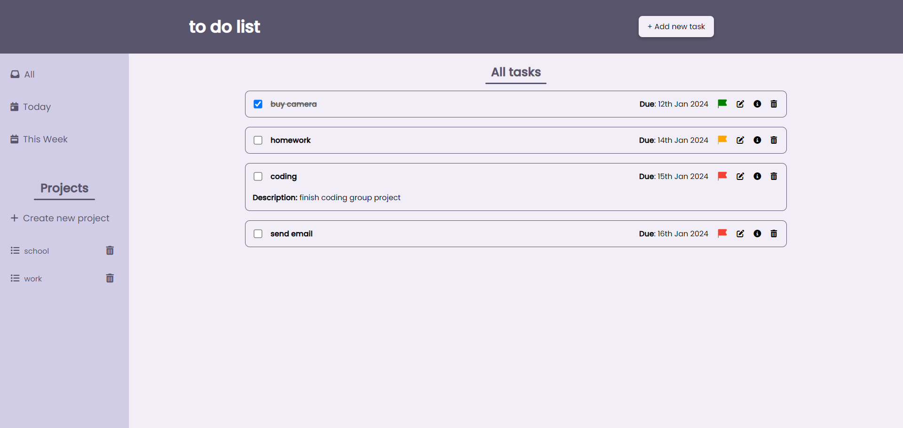

## Table of contents

- [Overview](#overview)
  - [The challenge](#the-challenge)
  - [Screenshots](#screenshots)
- [My process](#my-process)
  - [Built with](#built-with)

## Overview

### The challenge

- Created a To-Do List as part of [The Odin Project](https://www.theodinproject.com)
- Live demo: https://itskharina.github.io/todo-list/

Users should be able to:

- Organize tasks by creating distinct projects.
- Easily add, remove, and mark tasks as complete within your projects.
- View detailed information about each task and make edits as needed.
- Have tasks remain visible even after refreshing the page.

### Screenshots

## My process

### Built with

- Webpack
- Semantic HTML5 markup
- SCSS (compiled to CSS)
- JavaScript
